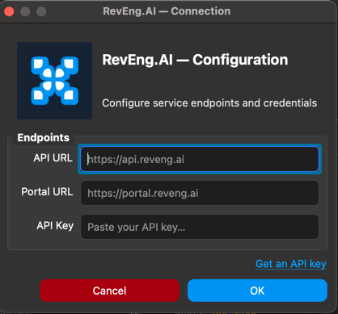
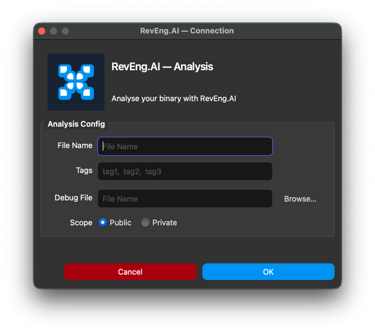
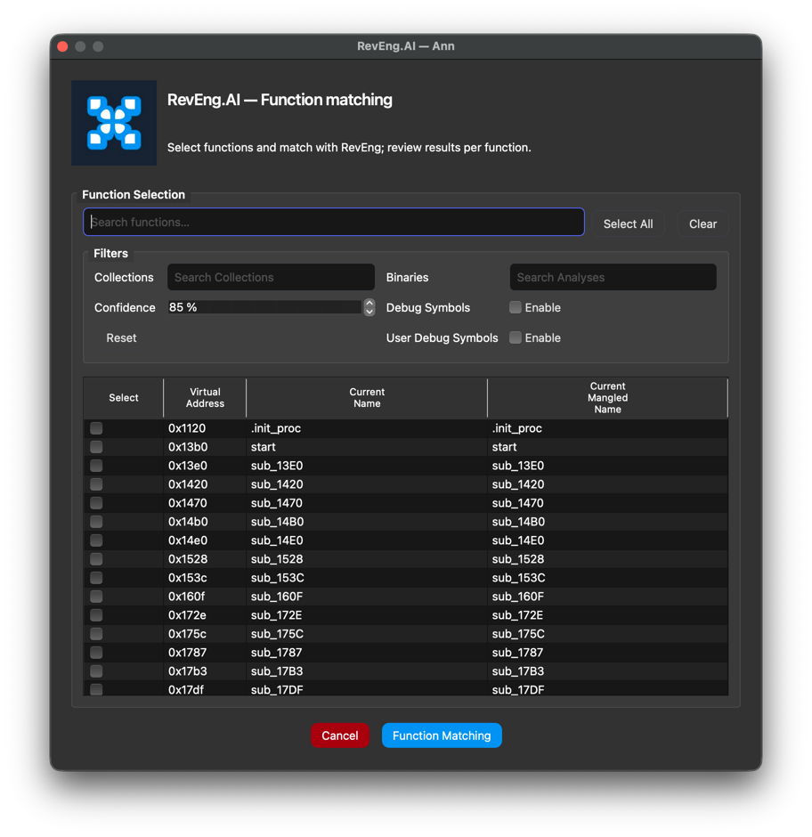
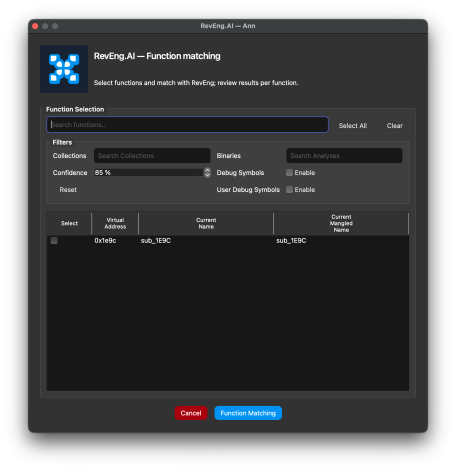
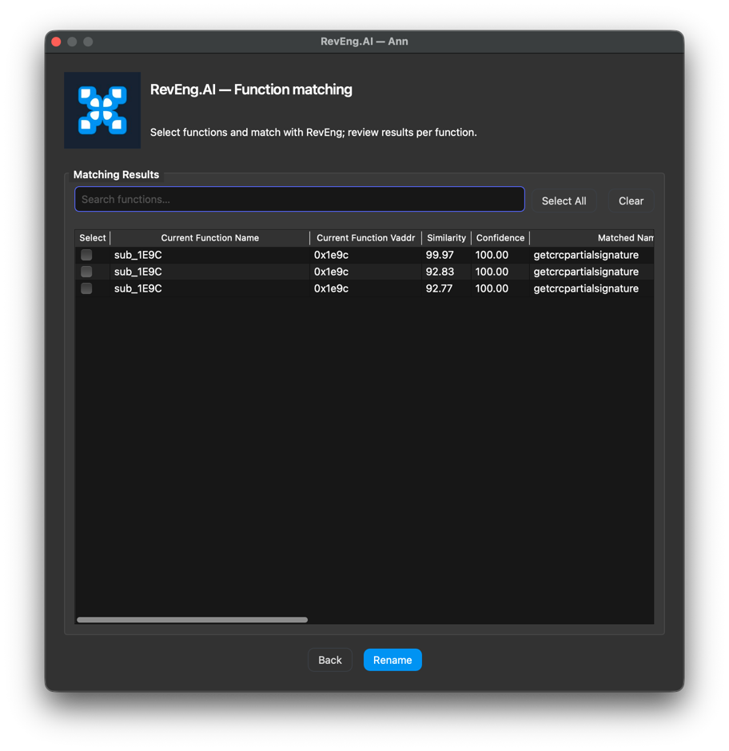
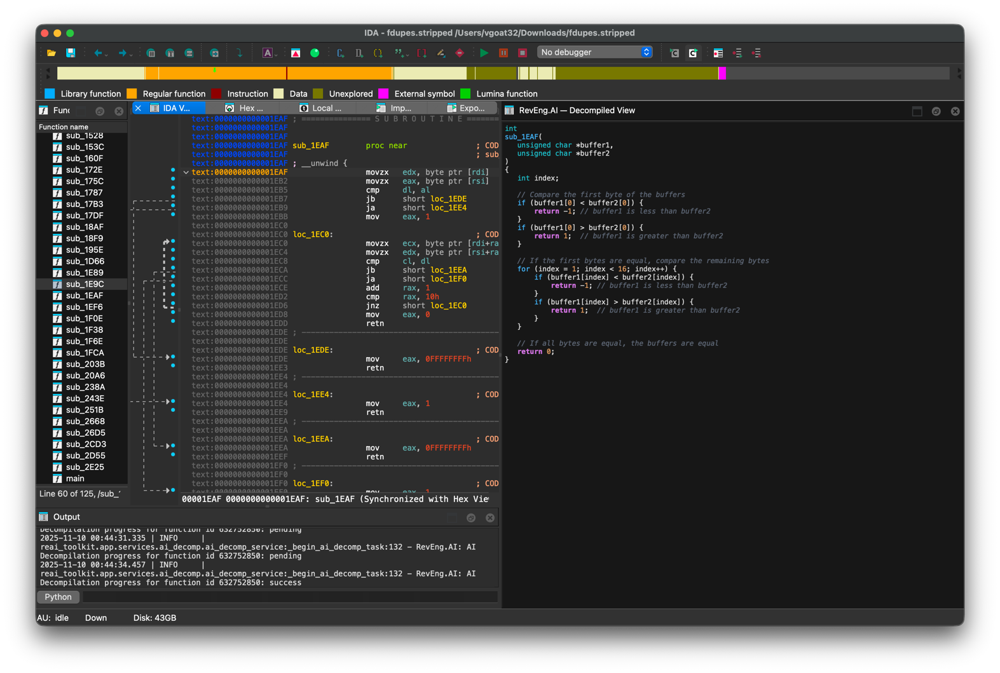

# RevEng.AI IDA Plugin

[Discord](https://discord.com/invite/ZwQTvzfSbA)

### AI Assisted Binary Analysis

Released as open source by RevEng.ai - https://reveng.ai

## Description

The RevEng.AI IDA plugins allows you to interact with our API from within IDA.
This allows you to upload your currently open binary for analysis,
and use it for Binary Code Similarity to help you Reverse Engineer stripped binaries.


## Table of contents

- [Key Features](#key-features)
- [Installation](#installation)
  - [Compatibility](#Compatibility)
  - [Setup](#Setup)
  - [Verifying the Installation](#verifying-the-installation)
- [Usage](#usage)
  - [Configuration](#configuration)
  - [Analysis](#analysis)
  - [Auto Unstrip](#auto-unstrip)
  - [Function Matching](#function-matching)
  - [AI Decompilation](#ai-decompilation)
- [Contributing](#contributing)
  - [Reporting Bugs](#reporting-bugs)
- [Known Issues](#known-issues)


## Key features

* Upload the current binary for analysis
* Automatically rename all functions above a confidence threshold
* Show similar functions and their names for one selected function
* AI Decompilation of selected functions

## Installation

The builds for latest stable version of the RevEng.AI IDA plugin can be downloaded from the [Releases](https://github.com/revengai/plugin-ida/releases/latest) page.

### Supported IDA versions

We support the following IDA versions and platforms: `8.5`, `9.0`, `9.1`, `9.2` and Python version from `3.10` to `3.14`.

### Setup

1. **Download** the plugin code for your platform and Python version from the [Releases](https://github.com/revengai/plugin-ida/releases/latest) page.
2. **Extract** the archive contents into your IDA user plugin directory.

    **macOS / Linux**
    IDA Plugins are typically located in:
    ```bash
    ~/.idapro/plugins/
    ```
    **Windows**
    ```bash
    %AppData%\Hex-Rays\IDA Pro\plugins\
    ```
    Then run the following commands in your terminal or command prompt, adjusting for your platform and architecture as appropriate:
    ```bash
    unzip reveng_ida_plugin_<platform>_<architecture>_py<python-version>.zip  -d ~/Downloads/
    mv ~/Downloads/reai_toolkit_entry.py ~/.idapro/plugins/
    mv ~/Downloads/reai_toolkit ~/.idapro/plugins/
    ```
   
    After extraction, the directory structure should look like this:
    ```bash
    ~/.idapro/plugins/
    ├── reai_toolkit_entry.py
    └── reai_toolkit/
        ├── app/
        ├── hooks/
        ├── vendor/
        └── ...
    ```

3. **Restart** IDA if it was running.

### Verifying the Installation
Once IDA is open, confirm that the RevEng.AI menu appears in the top bar.
If no errors are displayed in the console and the menu loads, your installation is complete.

## Usage

In this section, we provide an example workflow for our plugin.

### Configuration

The first thing we need to do is configure the plugin with our API key and the host to use.

When you load the plugin for the first time, or by selecting `RevEng.AI -> Configure`, you will be guided through the configuration process.



Enter your API Key from the [RevEng.AI Portal](https://portal.reveng.ai/settings) into the API Key field
where it will be validated and saved for future use.

### Analysis
Once configured, you can upload the current binary for analysis by selecting `RevEng.AI -> Analysis -> Create New`.
It's usually enough to keep the default options, but you can adjust the analysis settings as needed.



You can check the status of your analysis in the `RevEng.AI -> Analysis -> Check Status` option. Starting an analysis also automatically begins polling for status updates.
Example logs may look like this:
```
2025-11-10 00:25:24.755 | INFO     | reai_toolkit.app.services.upload.upload_service:analyse_file:87 - RevEng.AI: Uploaded binary file
2025-11-10 00:25:24.768 | INFO     | reai_toolkit.app.services.upload.upload_service:analyse:185 - RevEng.AI: Collected 126 functions from IDA
2025-11-10 00:25:24.768 | INFO     | reai_toolkit.app.services.upload.upload_service:analyse:188 - RevEng.AI: Base address: 0x0
2025-11-10 00:25:26.319 | INFO     | reai_toolkit.app.services.upload.upload_service:analyse:209 - RevEng.AI: Analysis started successfully. Analysis ID: 715916, Binary ID: 731870
2025-11-10 00:25:38.639 | INFO     | reai_toolkit.app.services.analysis_status.analysis_status:_poll_analysis_status:74 - RevEng.AI: Analysis Status - Processing
2025-11-10 00:25:48.826 | INFO     | reai_toolkit.app.services.analysis_status.analysis_status:_poll_analysis_status:74 - RevEng.AI: Analysis Status - Complete
```

### Auto Unstrip

The `Auto Unstrip` tool allows you to automatically recover function names based on our debug symbol database. It is 
an automated process that will recover all function names from the currently attached binary.

You can access it by selecting `RevEng.AI -> Auto Unstrip` from the menu.

### Function Matching

The function matching tool allows you to rename functions in a binary based on similarity to functions in our database.
It is a manual process that can be done on a per-function basis, or in batch mode for the entire binary. It allows you 
to have more control over which functions are renamed, and when as well as the ability to review the suggested names before
applying them.

To match with all functions in the binary, select `RevEng.AI -> Function Matching`.


Or to match a single function, `Right-Click` on the function in the disassembly view and select `RevEng.AI -> Match Function`.


Adjust the filters as necessary and when ready click `Function Matching`.
For multiple functions at most 1 result will be returned. For individual functions, up to 10 functions will be returned.
You can then decide to rename a function to one of the suggested names by clicking `Rename`.



### AI Decompilation

The `AI Decompilation` tool allows you to get AI generated decompilation of selected functions. You can access it by
right-clicking on a function in IDA's listing or decompiler view and selecting `AI Decompilation`.


The window will show you the AI generated decompilation of the selected function as well as a
natural language explanation of what the function does.

The window can be pinned and will update as you select different functions.

## Contributing

We welcome pull requests from the community.

The plugin is still undergoing active development currently, and we are looking for feedback on how to improve it.

### Reporting Bugs

If you've found a bug in the plugin, please open an issue via [GitHub](https://github.com/RevEngAi/plugin-ida/issues/new/choose), or create a post on our [Discord](https://discord.com/invite/ZwQTvzfSbA).

## Known Issues
* The plugin is unstable on macOS with IDA 9.2. We are actively working on a fix for this.
* On macOS Tahoe the first time you run the plugin you will need to allow execution from untrusted developers. To do this, go to `System Preferences -> Security & Privacy` and click `Open Anyway` for the RevEng.AI plugin.


